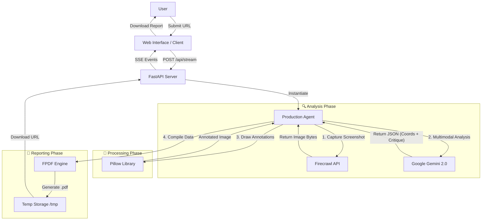

# AI Agent UI Product Analysis 🕵️‍♂️

An autonomous AI product UI agent that analyze your landing page for fintech (Trading Platforms). It provides actionable UX/UI conversion optimization feedback, complete with "viral-style" visual annotations and a professional PDF report.

##  Features

- **Automated Analysis**: instantly captures full-page screenshots of any URL.
- **AI-Powered Insights**: Uses **Google Gemini 2.0 Flash** to act as a Senior UX/UI Conversion Expert.
- **Visual Annotations**: Automatically draws "clickbait/viral" style annotations (yellow arrows, punchy text) on screenshots to highlight areas for improvement.
- **PDF Reports**: Generates detailed PDF reports containing an executive summary, key findings, and annotated visuals.
- **Real-Time Feedback**: Streams progress updates to the user interface via Server-Sent Events (SSE).

##  Tech Stack

- **Backend**: Python, FastAPI
- **AI & Vision**: Google Gemini (`google-genai`), Firecrawl (`firecrawl-py`)
- **Image Processing**: Pillow (`PIL`)
- **Report Generation**: `fpdf`
- **Frontend**: HTML, Jinja2 Templates, Vanilla JS
- **Deployment**: Ready for Vercel (Serverless)

## 🏗️ Architecture

## 📦 Installation

1.  **Clone the repository:**
    ```bash
    git clone https://github.com/AhmedSAAhmed/mystery-shopper-AI-Agent.git
    cd mystery-shopper-AI-Agent
    ```

2.  **Create a virtual environment:**
    ```bash
    python -m venv venv
    
    # Windows
    venv\Scripts\activate
    
    # Mac/Linux
    source venv/bin/activate
    ```

3.  **Install dependencies:**
    ```bash
    pip install -r requirements.txt
    ```

4.  **Set up Environment Variables:**
    Create a `.env` file in the root directory and add your API keys:
    ```ini
    FIRECRAWL_API_KEY=your_firecrawl_key
    GOOGLE_API_KEY=your_google_gemini_key
    ```

## 🏃‍♂️ Usage

1.  **Start the server:**
    ```bash
    uvicorn server:app --reload
    ```

2.  **Open the application:**
    Navigate to `http://localhost:8000` in your browser.

3.  **Run an audit:**
    - Enter the URL of the landing page you want to analyze.
    - Watch the real-time logs as the agent captures, analyzes, and annotates the page.
    - Click the download link to view your **Conversion Audit Report**.

## 📂 Project Structure

- `agent.py`: Core logic for the AI agent, handling API calls to Firecrawl/Gemini and image processing.
- `server.py`: FastAPI application handling web routes, streaming, and file downloads.
- `templates/`: HTML templates for the frontend.
- `static/`: Static assets (CSS/JS).
- `requirements.txt`: Python package dependencies.
- `vercel.json`: Configuration for deployment on Vercel.

## 🤝 Contributing

Contributions are welcome! Please feel free to submit a Pull Request.
